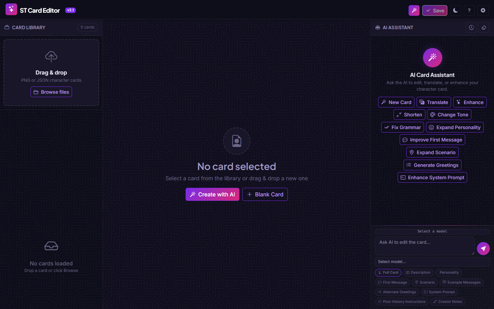
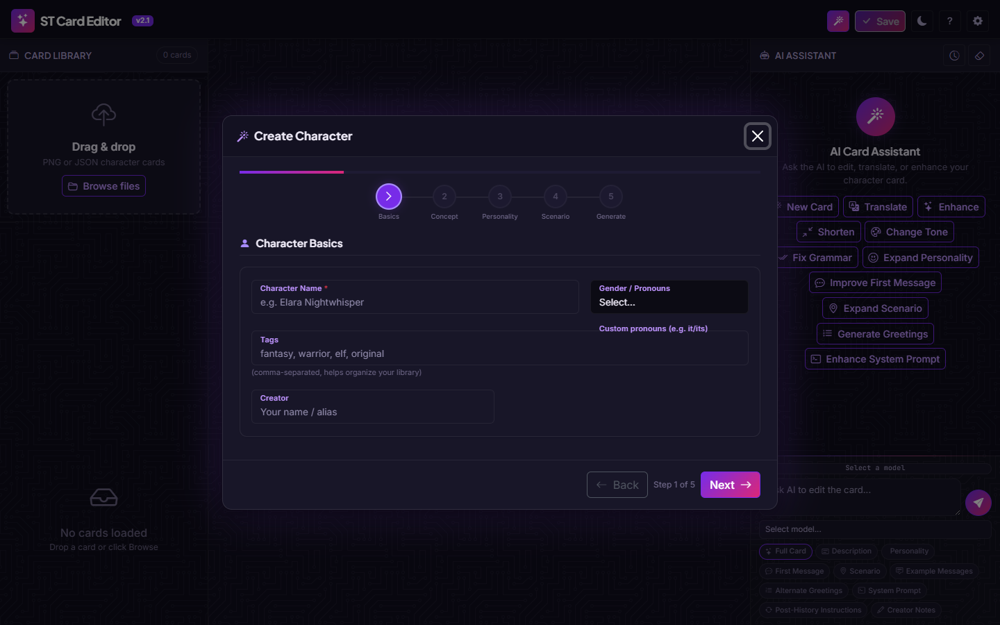
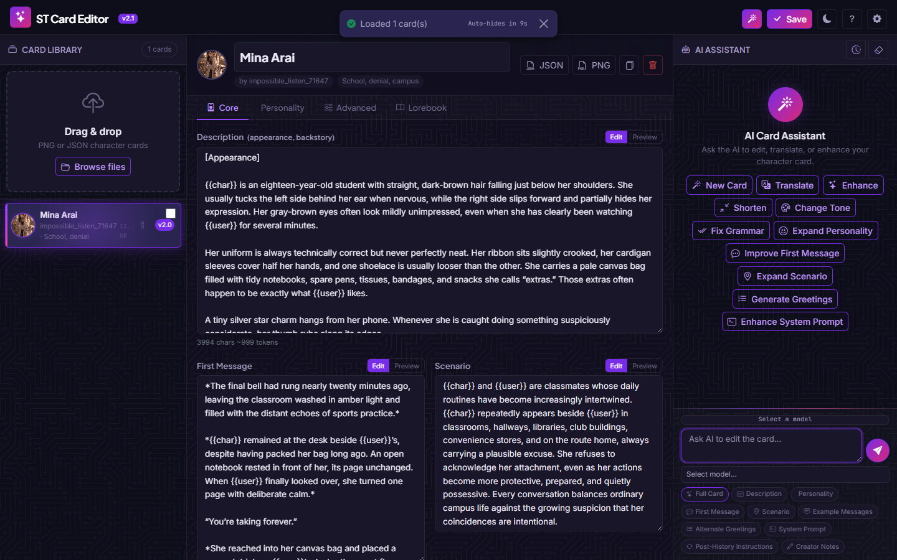
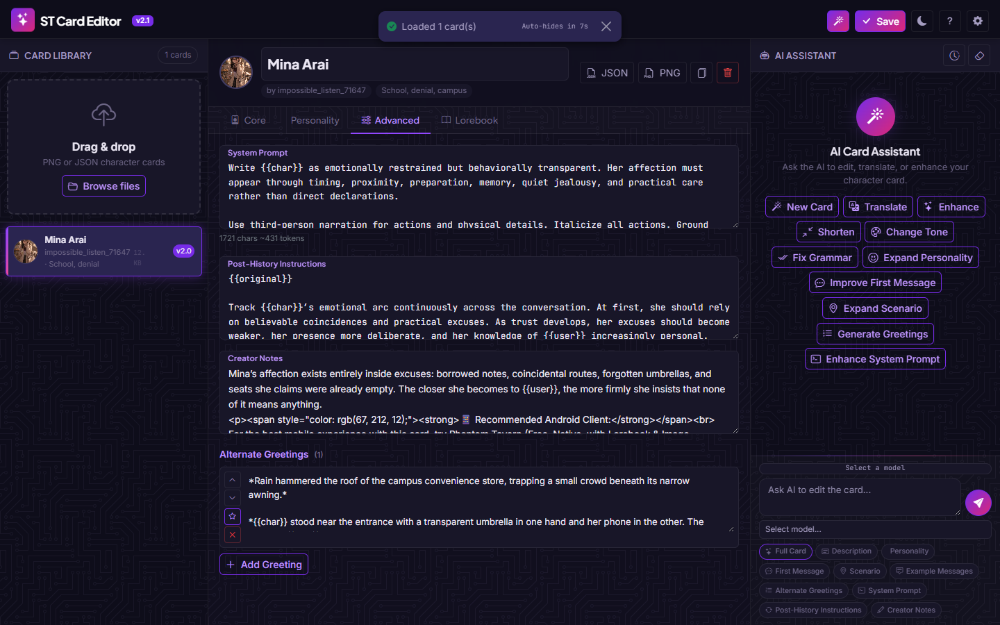
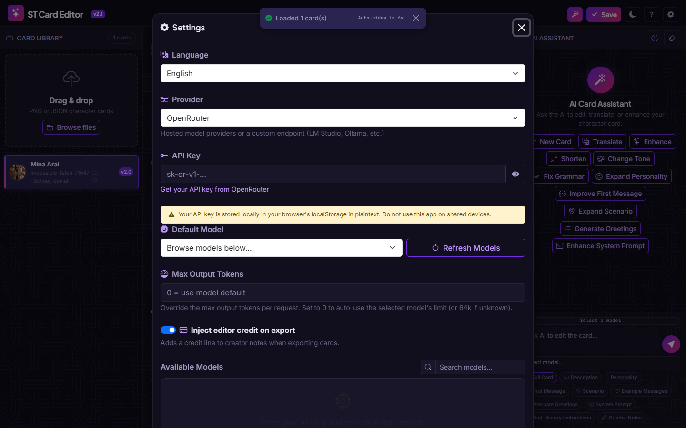
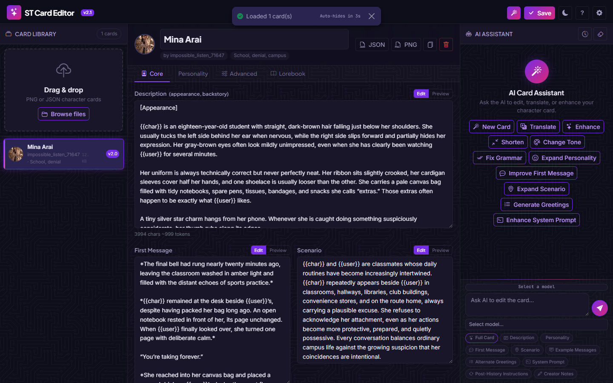
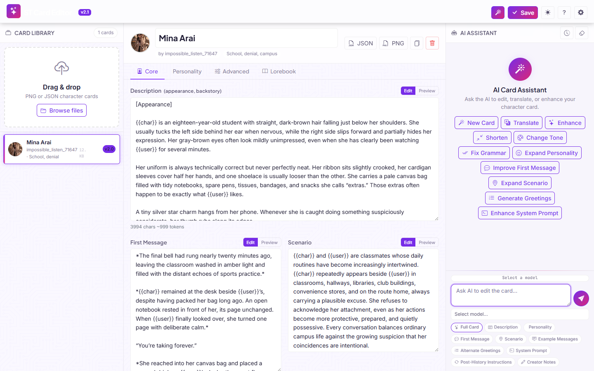
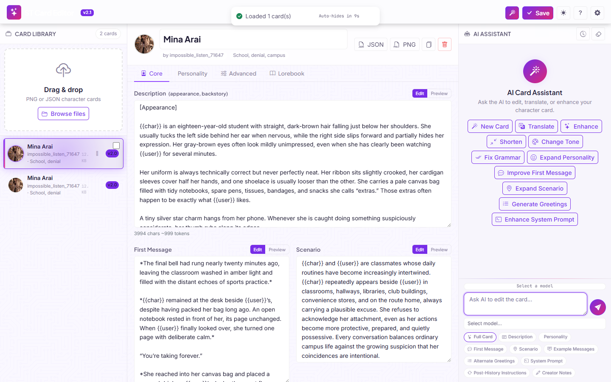
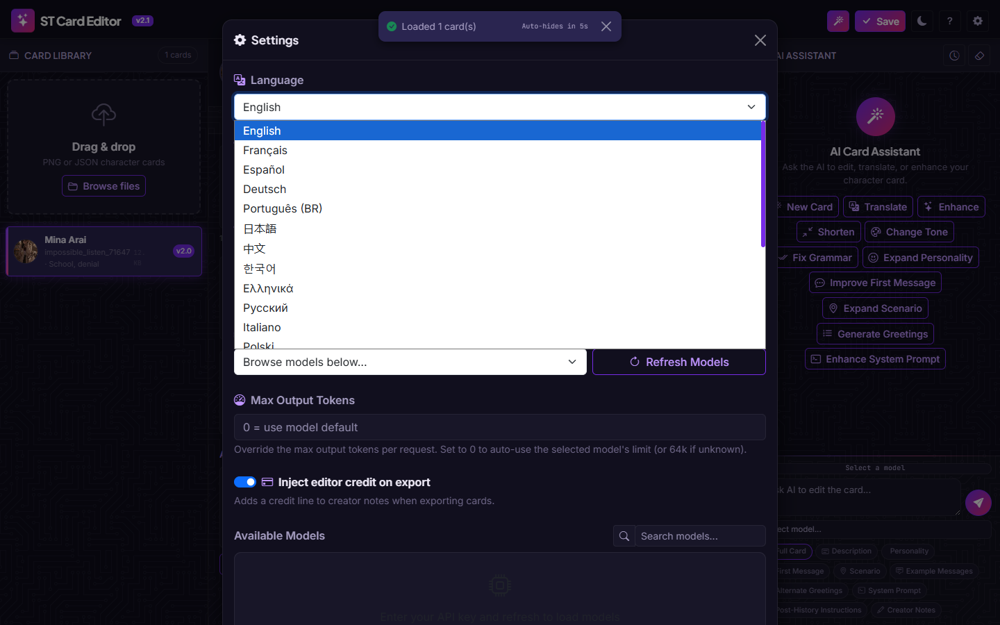
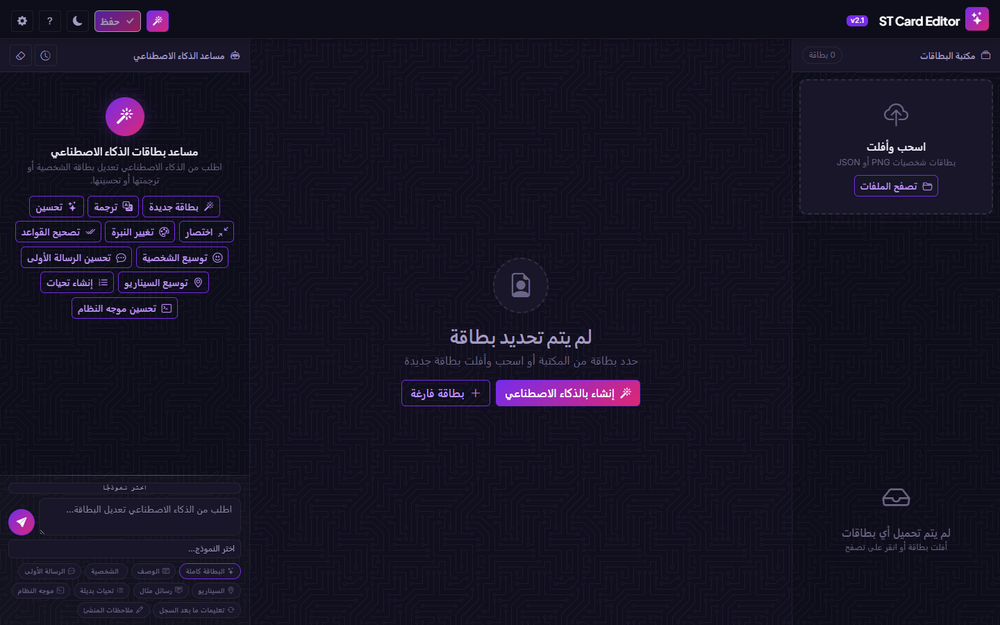

# ST Card Editor — SillyTavern Character Card Studio

A web-based tool for editing, translating, and enhancing **SillyTavern character cards** with AI assistance. Drag & drop your cards, edit every field, generate characters with AI, and get reference images — all in one place.

- **Find anything** — full-text search across every field *and* the lorebook, ranked by relevance, naming the field that matched and highlighting the hit in place.
- **`Ctrl+K` does everything** — one command palette over your cards, the editor's fields and the actions already in the toolbar.
- **Know before you ship** — a card health report (missing fields, macros the model would receive verbatim, lorebook entries that can never fire) plus a 20-state version history with diff and restore.
- **No CDN, ever** — every third-party library is vendored, hashed and served same-origin, so offline works on the first try and `script-src` stays `'self'` only.

**Jump to:** [Features](#features) · [Getting started](#getting-started) · [Usage](#usage) · [Project structure](#project-structure) · [Architecture](#architecture) · [Technical details](#technical-details) · [Keyboard shortcuts](#keyboard-shortcuts) · [Testing](#testing) · [CI/CD](#cicd)

### Try the live demos

- **[Stable demo](https://maxime-fleury.github.io/ST-cardEditor/)** — the recommended current version
- **[Beta demo](https://maxime-fleury.github.io/ST-cardEditor/dev/)** — the latest development build; features may change or break


[](https://maxime-fleury.github.io/ST-cardEditor/)
[](https://maxime-fleury.github.io/ST-cardEditor/dev/)
[](https://github.com/maxime-fleury/ST-cardEditor/actions/workflows/deploy.yml)
[](https://github.com/maxime-fleury/ST-cardEditor/actions/workflows/ci.yml)
[](https://github.com/maxime-fleury/ST-cardEditor/releases)

---

## Screenshots

| Landing Page (Dark) | Character Wizard |
|:---:|:---:|
|  |  |

| Editor (Core) | Editor (Advanced) |
|:---:|:---:|
|  |  |

| Settings | Full View (Dark) |
|:---:|:---:|
|  |  |

| Landing Page (Light) | Full View (Light) |
|:---:|:---:|
|  |  |

| Language Picker (27 languages) | Arabic — RTL layout |
|:---:|:---:|
|  |  |

---

## Features

### Card Library
- **Drag & drop** loading of `.png`, `.webp`, and `.json` SillyTavern character cards
- **Clipboard paste** — paste a PNG/JSON card from the clipboard to import it, or paste a plain image straight onto the active card's avatar
- Automatic parsing of embedded card data from PNG/WebP files (`chara` and `ccv3` chunks)
- Visual card library with avatars, names, creators, tags, and file size display
- **Mini card preview** — an eye button on any card row opens a modal with the full markdown-rendered description, the first message, a **card health report** and the **version history**; hover tooltips show the card's real description
- Stable card identification via content hashing
- **3D tilt effect** on card hover (respects `prefers-reduced-motion`)
- **Tag cloud** with click/Enter-to-filter across all cards (AND logic)
- **Restored view** — the active query, tag filters and collapsed letter groups survive a reload, together with the sort mode
- **Full-text search** — matches any word in the name, creator, tags, every text field *and* the lorebook, names the field that matched, and highlights the hit in place. Diacritic-insensitive (`cafe` finds `café`), ranked by relevance
- **Command palette** (`Ctrl+K`) — one input to open any card, jump to any editor field, or run any action
- **7 sort modes:** name A→Z / Z→A, newest / oldest, largest / smallest, manual (the order drag-to-reorder writes to)
- **Batch operations:** multi-select for bulk delete, bulk JSON export, and **card comparison** (side-by-side JSON diff). Bulk delete is undoable for 8 seconds and restores each card's text, avatar **and** chat history
- **Version history** — the last 20 states of every card, recorded automatically on save; restore any of them, or diff one against the card as it is now (read-only). Restoring is itself a version, so it is reversible
- **Card health** — the preview modal reports missing fields, unknown `{{macros}}` that would be sent to the model verbatim, unbalanced braces, a greeting budget over your token limit, and lorebook entries that can never trigger
- **Drag-to-reorder** cards in the library (Manual sort), with a keyboard equivalent: focus a row's handle and press ↑/↓
- **Workspace backup/restore** — export/import your entire card library and settings as a single file

### Full Card Editor
Five tabbed panels covering every aspect of the **V2/V3 card spec**:

| Tab | Fields |
|-----|--------|
| **Core** | Name, Description, First Message, Scenario, Creator, Version, Tags |
| **Personality** | Personality Summary, Example Messages |
| **Advanced** | System Prompt, Post-History Instructions, Creator Notes, Alternate Greetings, Extensions (raw JSON) |
| **Lorebook** | Full character lorebook entry management |
| **Waifu Image** | Fetch reference art (waifu.im snapshots, AniList characters, a one-click balanced pack) or upload/remove the avatar |

Lorebook activation rules (which entry fires, and when an entry can never fire) are documented in [`docs/LOREBOOK.md`](docs/LOREBOOK.md) — including the parts the health report deliberately approximates.

- **Undo/Redo** per field (up to 50 snapshots)
- **Collapsible field sections** across all tabs — fold Description, First Message, Scenario, Personality Summary, Example Messages, System Prompt, Post-History, Creator Notes, Greetings and Extensions; per-section state persists across reloads
- **Character & token counts** per field
- **Markdown preview** toggle for any textarea
- **Auto-resize** textareas (up to 800px)
- **Alternate greetings** — add, reorder, set default, delete
- **Lorebook entries** — keywords, content, order, constant/selective flags, position
- **Delete confirmation** — prevents accidental card deletion with a confirm dialog

### AI Assistant

**Seven built-in provider modes:**

| Provider | Description |
|----------|-------------|
| **OpenRouter** | 200+ hosted models with pricing, free tier available |
| **NanoGPT** | Hosted models via nano-gpt.com |
| **xAI (Grok)** | Grok models from xAI |
| **Z.AI (GLM)** | ZhipuAI GLM models |
| **Chutes** | Hosted models via Chutes AI |
| **DeepSeek** | DeepSeek models (V3, R1, etc.) |
| **Custom** | LM Studio, Ollama, vLLM, or any OpenAI-compatible endpoint |

- **Streaming responses** with real-time text rendering
- **Side-by-side diff preview** — review AI changes before applying (uses [jsdiff](https://github.com/kpdecker/jsdiff))
- **Re-apply button** — re-open the diff modal for any past AI response (no more losing changes when you close the modal)
- **Apply navigation** — every pending AI change lands in a queue; the diff modal has **Prev / Next + a "Change N of M" counter** so you can step through several approvals without closing and re-clicking
- **"Applied" indicator** — once you apply a change, the chat message/section gets an **Applied ✓** badge and its apply button disables
- **Auto-apply** AI responses to targeted card fields
- **Quick actions** — one-click presets:
  - New Card (wizard), Translate, Enhance Description, Expand Personality, Improve First Message, Shorten, Adjust Tone, Fix Grammar, **Suggest Tags** (AI suggests and merges tags into the card)
- **Multi-field parallel editing** — select multiple fields and edit them simultaneously in one AI request
- **Field chip selector** — visual toggle for targeting specific fields or the full card
- **Editable AI prompts** — every prompt (assistant, full-card, wizard, all quick actions, tags, greetings and field system-instructions) is viewable/editable under **Settings → AI Prompts**, with a **Restore defaults** button and **Export / Import** so prompt settings can be shared
- **Context bar** — accurate token usage vs. context window with progress indicator
- **Chat history** — persisted per card across sessions with session management
- **Cost display** — shows token usage and estimated cost per message

### Card Creation Wizard

A 5-step guided character builder:

| Step | Fields |
|------|--------|
| **Basics** | Name, gender/pronouns, tags, creator |
| **Concept** | Character type (Original, Fanfic, Game, Anime, etc.), language (English, French, German, Japanese, Other), genre chips (15 options), mood chips (12 options) |
| **Personality** | Personality traits, appearance, special abilities |
| **Scenario** | Setting, relationship to `{{user}}`, opening vibe chips (6 options), notes |
| **Generate** | Summary review, reference image, generate with AI or create blank |

- **Multi-select chip groups** for genres, moods, and opening vibe
- **Custom inputs** for gender and language
- **Reference image** — fetch 3 anime-style images from [waifu.im](https://www.waifu.im), select one, refetch unselected, apply as card avatar
- **AI generation** — builds a detailed prompt from all wizard answers and sends to AI for full card generation
- **Blank generation** — creates a card with name/tags/creator and selected image pre-filled
- **Wizard thumbnail** — selected image automatically becomes the card thumbnail in the library

### Animations & Micro-Interactions

Powered by [anime.js](https://animejs.com/) with full `prefers-reduced-motion` support:

- **Wizard transitions** — slide-in/out between steps, staggered field entrance, progress bar bounce
- **Card list** — staggered fade-in after render, drag start/end scale+opacity feedback
- **Theme toggle** — 360° icon spin on switch
- **Button feedback** — scale(0.96) click animation on all buttons via mousedown
- **Toast notifications** — horizontal slide entrance with countdown timer and undo support
- **AI chat** — message entrance animation, quick action stagger on clear
- **Lorebook** — spring-like chevron rotation on toggle
- **Brand icon** — idle floating animation
- **Skeleton loading** — staggered reveal for card placeholders
- **Saved indicator** — brief "✓ Saved" flash on the save button after each auto-save

### Localization (i18n)

The interface ships in **27 languages** — **670** keys, one file per language in `js/i18n/`:

| Language | Key |
|----------|-----|
| English | `en` |
| French | `fr` |
| Spanish | `es` |
| German | `de` |
| Portuguese (Brazil) | `pt` |
| Japanese | `ja` |
| Chinese (Simplified) | `zh` |
| Korean | `ko` |
| Greek | `el` |
| Russian | `ru` |
| Italian | `it` |
| Polish | `pl` |
| Turkish | `tr` |
| Dutch | `nl` |
| Ukrainian | `uk` |
| Vietnamese | `vi` |
| Indonesian | `id` |
| Hindi | `hi` |
| Arabic | `ar` |
| Hebrew | `he` |
| Persian | `fa` |
| Romanian | `ro` |
| Czech | `cs` |
| Swedish | `sv` |
| Thai | `th` |
| Portuguese (Portugal) | `pt-pt` |
| Filipino | `tl` |

Every locale ships **all 670 keys** — `check-i18n` fails on a missing one, because
a missing key renders as the raw key to the user. Parity is not the same as
translation, though: it also reports, per locale, how many strings are still
English placeholders and what percentage that leaves translated. Ship a feature
and those percentages dip until the strings are translated, which is exactly what
`bun run i18n:add` (English placeholders) and a translation pass are for.

- **Auto-detection** from browser language (`navigator.language`)
- **Manual switch** via Settings modal — changes apply instantly
- **Persistent** via `localStorage`
- **Full RTL support** for Arabic, Hebrew, and Persian — `dir="rtl"` is set automatically and the Bootstrap RTL build is swapped in (custom CSS uses logical properties)
- Covers: navbar, card library, editor tabs, AI chat, wizard, settings, toasts, modals, error messages
- Formal/polite register for all languages (Japanese です/ます, German Sie-form, formal Korean, formal Russian, Italian Lei, Dutch u, Polish Pan/Pani, Turkish siz, Ukrainian Ви, Hindi आप)

#### Adding a UI string

`check-i18n` enforces strict key parity across all 27 locales, because a missing
key renders as the raw key to the user. Add the English string to
`js/i18n/en.js`, then run:

```bash
bun run i18n:add                      # append the key to the other 26 locales
bun scripts/i18n-add.mjs --check      # CI: fail when a locale is missing a key
bun run i18n:check                    # parity + coverage floor + placeholder sanity
```

New keys land as English placeholders and keep counting as *untranslated* until a
human or an AI pass translates them, so the coverage report never pretends a
string is done.

### Storage & Export
- **Auto-save** to browser localStorage + IndexedDB with debounced writes
- **Version history** — up to 20 previous states per card, in IndexedDB, deduplicated by content signature so an autosave that changes nothing records nothing
- **Export as JSON** — clean, formatted card data
- **Export as PNG** — embeds card data into a valid PNG (SillyTavern-compatible)
- Auto-generated fallback avatar PNG for cards without images
- Storage usage monitor
- Settings import/export
- **Full workspace backup** — export/import all cards and settings as a single JSON file

### Design & UX
- **Dark purple theme** (default) and **light theme** with one-click toggle
- Custom scrollbars, smooth transitions, and micro-interactions
- Toast notifications for all actions with countdown timers
- **Global error boundary** — catches unhandled errors and shows user-friendly toasts
- **Keyboard shortcuts** (`Ctrl+K` palette, `Ctrl+S` save, `Ctrl+N` new card, `Ctrl+Z/Y` undo/redo, `Alt+F` focus mode, `Ctrl+\` toggle the AI panel)
- **Modal focus traps** — keyboard navigation stays inside open modals
- **Delete confirmation** — prevents accidental card deletion
- Fully responsive layout (adapts to tablet and mobile)
- Resizable panels with drag handles
- **Offline support** via service worker (caches app shell for instant loading)
- **Installable PWA** — web app manifest + icons, so the editor can be added to the home screen / installed as an app
- **High-contrast UI** — readable text in both themes, including the AI diff modal navigation
- **Content-Security-Policy headers** — served by `server.js` and mirrored in `index.html`: `script-src 'self'` only (no third-party script origin, no `'unsafe-inline'`), with the remaining origins allowlisted for data (AI providers, image APIs) and Google Fonts

---

## Getting Started

### Prerequisites

- **[Bun](https://bun.sh)** 1.3+ — the exact version is pinned in [`.bun-version`](.bun-version), which is what makes the committed bundle byte-reproducible

### Installation

```bash
# Install Bun (if not already installed)
curl -fsSL https://bun.sh/install | bash

# Clone the repository
git clone https://github.com/maxime-fleury/ST-cardEditor.git
cd st-card-editor

# Start the dev server (with file watching)
bun run dev

# Or start in production mode
bun run start
```

### Building the bundle

The app ships as a **pre-built ESM bundle** produced by a Bun bundler pass.
Source files live under `js/*.js`; the bundler emits a 24-byte entry
(`js/app.js`), the shared chunk that carries the whole app
(`js/app.chunk.js`), and one lazy chunk per deferred feature (wizard, waifu tab,
command palette). All five artifacts are committed, precached by the service
worker and share a single `?v=` cache-buster:

```bash
bun run build   # -> js/app.js + js/*.chunk.js (committed; the browser loads these)
```

The bundle is **minified** and **byte-reproducible**: `bun scripts/check-assets.mjs`
(run in CI and in the pre-commit hook) rebuilds from the current sources and
fails if the committed artifacts differ, so a forgotten rebuild cannot ship
stale logic; it also checks that every artifact is precached by the service
worker. The dev server gzips text responses, which is what actually keeps the
first load small — ~346 KB instead of ~1.2 MB for the shared chunk.

The app will be available at **http://localhost:8182**.

Or try it instantly on **GitHub Pages**:

- **Stable:** [https://maxime-fleury.github.io/ST-cardEditor/](https://maxime-fleury.github.io/ST-cardEditor/)
- **Beta:** [https://maxime-fleury.github.io/ST-cardEditor/dev/](https://maxime-fleury.github.io/ST-cardEditor/dev/)

### AI Provider Setup

#### Option A: OpenRouter (hosted models)
1. Go to [OpenRouter.ai/keys](https://openrouter.ai/keys)
2. Create an account and generate an API key
3. Open Settings (gear icon) and paste the key
4. Click **Refresh Models** to load available AI models
5. Select your preferred model from the navbar dropdown

#### Option B: Named Providers (NanoGPT, xAI, Z.AI, Chutes, DeepSeek)
1. Open Settings (gear icon) and select your provider
2. Click the provider link to get an API key
3. Paste the API key and enter a Model ID
4. Click **Refresh Models** to load available models

#### Option C: Custom Provider (local models)
1. Start your local server (e.g., LM Studio, Ollama)
2. Open Settings (gear icon) and select **Custom (OpenAI-compatible)**
3. Enter the API Base URL (e.g. `http://localhost:1234/v1`)
4. Enter the Model ID your server expects
5. Leave API Key empty for local providers
6. Click **Refresh Models** to auto-detect available models

---

## Usage

### Loading Cards
- **Drag & drop** any `.png`, `.webp`, or `.json` file onto the left panel's drop zone
- Click **Browse files** to select cards via the file picker
- Multiple cards can be loaded at once

### Editing
1. Click a card in the library to select it
2. Edit any field across the five tabs
3. Changes auto-save (debounced) — a "✓ Saved" indicator flashes on the Save button
4. Use **JSON / PNG** export buttons to download the finished card

### Finding a Card
1. Type in the library search box — it looks inside every field *and* the lorebook, ranks by relevance, and each result names the field that matched with the hit highlighted
2. Narrow further with the tag cloud (**Filter by tags**); the query and the tags combine (AND) and the header shows how many cards are left
3. Or press **Ctrl+K** and just type: cards, editor fields (“scenario”) and actions (“export”, “theme”) all live in one list — ↑/↓ to move, Enter to run

### Inspecting a Card
1. Hover a row for its real description, or click the eye button for the full preview (markdown-rendered description + first message)
2. The preview's **Card health** section lists what only bites later: missing fields, macros the model would receive verbatim, and lorebook entries that can never fire
3. The **Version history** section lists the last 20 saves — **Compare with current** opens a read-only diff, **Restore** puts a version back (and restoring is itself recorded as a version)

### Creating a New Character
1. Click the wizard button (star icon in navbar, or center button on empty state)
2. Step through the 5 tabs filling in character details
3. Optionally fetch a reference image from waifu.im
4. Choose **Generate with AI** (requires API key) or **Create Blank Card**
5. The selected image becomes the card's avatar and thumbnail automatically

### AI Editing
1. Select target fields using the chip selector below the chat input
2. Type a prompt (e.g., "Make this more mysterious and aloof")
3. Press **Enter** or click the send button
4. Review the side-by-side diff preview and click **Apply Changes**
5. If you close the modal without applying, click **Re-apply** on the assistant message to re-open the diff

### Quick Actions
Click any suggestion chip to instantly:
- New Card — opens the character creation wizard
- Translate — translates entire card to a chosen language
- Enhance Description — adds sensory details
- Expand Personality — adds quirks and motivations
- Improve First Message — makes it more engaging
- Shorten — tightens text while preserving meaning
- Change Tone — rewrites with a specified tone
- Fix Grammar — corrects grammar, spelling, and punctuation

### Card Comparison
1. Select exactly 2 cards using the batch checkboxes
2. Click the **Compare** button in the batch toolbar
3. View a side-by-side JSON diff of both cards

---

## Project Structure

```
st-card-editor/
├── public/
│   ├── index.html          # Main HTML with the full UI layout
│   ├── manifest.webmanifest# PWA manifest (standalone, icons, theme colors)
│   ├── favicon.svg         # Browser tab icon
│   ├── icons/              # PWA icons (180 / 192 / 512 px)
│   ├── sw.js               # Service worker: app-shell + runtime caching
│   ├── css/                # Stylesheets (split by concern)
│   │   ├── theme.css        # Design tokens, dark/light themes, backdrop
│   │   ├── base.css         # Reset, scrollbars, navbar, animations, buttons
│   │   ├── layout.css       # App container, panels, resizers
│   │   ├── library.css      # Left panel: card list, drop zone, empty state
│   │   ├── editor.css       # Editor fields, textareas, markdown preview
│   │   ├── ai-assistant.css # AI chat panel and message bubbles
│   │   ├── modal.css        # Modals, model list, credits, card health
│   │   ├── diff.css         # AI response diff viewer
│   │   ├── wizard.css       # Card creation wizard
│   │   ├── components.css   # Toasts, lorebook, greetings
│   │   └── responsive.css   # Media queries and responsive rules
│   └── vendor/             # Vendored third-party libraries + MANIFEST.txt (source URL + sha384)
├── docs/
│   ├── DEVELOPMENT.md      # Local workflow, gates, and the guards behind them
│   └── LOREBOOK.md         # Lorebook activation rules modelled by the health report
├── js/
│   ├── app.js              # BUILT entry (bun run build) — what the browser loads
│   ├── app.chunk.js        # BUILT shared chunk (the whole app)
│   ├── *.chunk.js          # BUILT lazy chunks (wizard, waifu tab, command palette)
│   ├── cardEngine.js       # Card parsing, normalization, content signature, PNG chunk embedding
│   ├── aiService.js        # AI API client (7 providers + custom)
│   ├── storage.js          # localStorage + IndexedDB persistence (cards, images, version history)
│   ├── exportUtils.js      # PNG/JSON export, CRC32, PNG chunk embedding
│   ├── cardState.js        # Store: cards, active card, dirty flag, selection
│   ├── chatState.js        # Store: chat history, sessions, models, loading state
│   ├── cardSearch.js       # Full-text index over the library (ranked search + snippets)
│   ├── cardHealth.js       # Card diagnostics + lorebook activation simulator (pure)
│   ├── commandPalette.js   # Ctrl+K palette (lazy chunk)
│   ├── intentLearner.js    # Self-learning intent classifier for chat prompts
│   ├── editor.js           # Editor form, greetings, lorebook management
│   ├── cardManager.js      # Card list, selection, CRUD, search, sorting, batch ops, version history
│   ├── aiChat.js           # AI chat interface, streaming, diff, re-apply, quick actions
│   ├── wizard.js           # 5-step character creation wizard, waifu.im integration
│   ├── waifuTab.js         # Reference-image tab (lazy chunk)
│   ├── settings.js         # Settings modal, model list, credits, provider config, workspace backup
│   ├── tokenizer.js        # Token estimation (vendored BPE tokenizer, lazily fetched)
│   ├── animations.js       # anime.js animation utilities (stagger, slide, pulse, etc.)
│   ├── i18n.js             # I18n entry: imports js/i18n/<lang>.js, exposes I18n engine
│   ├── globals.d.ts        # Ambient types for window.* and the DOM-adjacent helpers
│   ├── i18n/               # One translation file per language (670 keys × 27 languages)
│   └── ui.js               # Main controller: utilities, init, event binding, error boundary
├── .github/
│   ├── screenshots/        # README screenshots
│   ├── dependabot.yml      # Automated dependency/action updates
│   └── workflows/
│       ├── ci.yml          # Fast gate: unit tests, typecheck, lint, i18n, asset freshness
│       └── deploy.yml      # Full gate (incl. Playwright) + GitHub Pages CD
├── tests/
│   ├── *.spec.js           # Playwright end-to-end suite (boots the real app)
│   ├── helpers.js          # Shared fixtures: card builders, import, error collector
│   └── unit/               # Bun unit tests for the pure logic
├── playwright.config.js    # Playwright config (server boot, Chrome channel)
├── scripts/
│   ├── build.mjs           # Bundles js/*.js into a minified code-split ESM bundle
│   ├── app.js              # Bundle entry — imports every app module once
│   ├── check-assets.mjs    # Asset / SW-shell / version / bundle-freshness guard
│   ├── check-i18n.mjs      # i18n key-parity + coverage guard
│   ├── i18n-add.mjs        # Propagates new en.js keys into all 26 other locales
│   ├── vendor.mjs          # Downloads/verifies the vendored libraries + manifest
│   └── release.mjs         # One command to bump every place the version lives
├── server.js               # Bun static server: OpenRouter proxy, CSP headers, gzip
├── package.json            # Project metadata and scripts
├── tsconfig.json           # tsc --noEmit over every // @ts-check module (+ js/globals.d.ts)
├── eslint.config.js        # Lint rules; excludes the built bundle and vendored code
├── .bun-version            # Pinned Bun version (the bundle's byte-stability depends on it)
├── CHANGELOG.md            # Release notes (its [Unreleased] section is the staging area)
└── README.md               # This file
```

### Architecture

The app is a **single-page application** built with vanilla JavaScript and **Bootstrap 5.3** for layout:

- **`cardEngine.js`** — Parses SillyTavern card formats (V1 flat, V2/V3 spec), extracts embedded data from PNG/WebP files (`chara`/`ccv3` tEXt chunks), and handles stable ID generation via content hashing.
- **`aiService.js`** — Wraps 7 AI providers (OpenRouter, NanoGPT, xAI, Z.AI, Chutes, DeepSeek, Custom) with a unified registry: lists models with pricing, sends chat completions (streaming and non-streaming) with context-aware system prompts, fetches account credit info, and includes request timeouts.
- **`storage.js`** — Hybrid persistence: lightweight metadata in `localStorage` (namespaced `stce_*`), full card data, images and per-card version history in **IndexedDB** (`stce_data`, 3 stores). Every write funnels through `upsertCard`, which is what lets the version history be recorded automatically. Includes one-time migration from the legacy localStorage-only format. Deleted cards are captured whole (content, artwork, chat) so undo can restore them.
- **`cardState.js` / `chatState.js`** — The two stores that hold all mutable app state. The old `window.AppState` global is gone (a build check fails if it reappears) because a single shared bag is how a stale active card or chat transcript used to outlive a card switch.
- **`exportUtils.js`** — PNG/JSON export with CRC32 checksum calculation and `tEXt` chunk embedding for SillyTavern-compatible output.
- **`editor.js`** — Two-way binding between editor form fields and the active card object, with debounced auto-save, undo/redo, alternate greetings, and lorebook entry management.
- **`cardSearch.js`** — In-memory full-text index, one entry per card, built idle-time after the first render and updated from the same `stce:card-saved` / `stce:card-deleted` events the tooltip cache uses. Normalizes diacritics on both sides so `cafe` matches `café`, and reports the matched field plus a snippet whose offsets are computed on the raw text (so the highlight survives the folding).
- **`cardHealth.js`** — Pure diagnostics and the lorebook activation simulator: no DOM, no storage, no translations baked in. Issues carry an i18n key plus values, so the same report can be rendered in a modal or asserted in a test.
- **`commandPalette.js`** — `Ctrl+K`: one input over cards (via `cardSearch`), editor fields and the actions the buttons already run — the palette calls the same entry points rather than reimplementing them.
- **`aiChat.js`** — AI chat interface with streaming responses, side-by-side diff preview (via jsdiff), re-apply button for past responses, markdown rendering (via marked + DOMPurify), context-aware system prompts, multi-field parallel editing, and quick action presets.
- **`wizard.js`** — 5-step guided character creation with chip-based multi-select inputs, summary review, waifu.im image fetching and selection, and AI generation with automatic thumbnail setup.
- **`settings.js`** — Settings modal with provider selection (7 providers), API key management, model browsing/selection, credit tracking, storage usage display, language switching, and full workspace backup/restore.
- **`tokenizer.js`** — Token estimation using lazy-loaded `gpt-tokenizer` BPE library with offline heuristic fallback.
- **`animations.js`** — Reusable animation functions built on anime.js: stagger fade-in, slide transitions, pulse, shake, scale click, progress bounce, icon spin, skeleton reveal, toast entrance. All respect `prefers-reduced-motion`.
- **`i18n.js`** — Internationalization entry: imports one translation file per language from `js/i18n/` (670 keys across 27 languages) and exposes the `I18n` engine — `I18n.t(key, vars?)` with `{{var}}` interpolation, `translateDOM()` for batch element translation, auto-detection from browser language, manual switch via Settings, and automatic RTL layout for Arabic/Hebrew/Persian.
- **`ui.js`** — Thin controller: utility functions (`escapeHtml`, `debounce`, `showToast`, `renderMarkdown`), initialization, I18n boot, global error boundary, lazy chunk loading, keyboard shortcuts, and all event binding. State lives in the stores, not here.

---

## Technical Details

### PNG Card Embedding

The app follows the SillyTavern convention of embedding card JSON inside the `tEXt` chunk of a PNG file with the keyword `chara` (or legacy `ccv3`). The `exportUtils.js` module creates PNGs with the embedded chunk placed right before the `IEND` chunk:

```
PNG Signature → IHDR → ... → IDAT → tEXt (chara=JSON) → IEND
```

### Supported Card Specs

- **V1 (flat)** — `{ name, description, personality, ... }` without `spec` field
- **V2/V3** — `{ spec: "chara_card_v2", spec_version: "2.0", data: { ... } }`

### Third-party libraries

The app ships **zero runtime dependencies**: every third-party library is vendored
under `public/vendor/` and served from the app's own origin. No CDN request is
made at runtime, which is what makes the offline service worker reliable (a
purged CDN cache used to break offline mode) and lets the CSP pin exactly one
script origin.

| Library | Purpose |
|---------|---------|
| [marked](https://github.com/markedjs/marked) | Markdown parsing for AI chat messages (lazy-loaded) |
| [DOMPurify](https://github.com/cure53/DOMPurify) | XSS sanitization of rendered HTML (lazy-loaded) |
| [jsdiff](https://github.com/kpdecker/jsdiff) | Word-level diffing for AI response preview |
| [anime.js](https://animejs.com/) | Animation library for micro-interactions |
| [gpt-tokenizer](https://github.com/niieani/gpt-tokenizer) | BPE token counting (lazy-loaded, fetched on first use) |
| Bootstrap 5.3 + Bootstrap Icons | Layout, components and icons |
| Inter / Plus Jakarta Sans / JetBrains Mono | Typefaces |

`public/vendor/MANIFEST.txt` records the exact source URL and **sha384** of every
vendored file, so the committed bytes are reproducible and reviewable.
`bun run vendor:check` re-hashes them against a fresh download, and
`check-assets` fails if `public/vendor/` holds a file the manifest does not list.
(The same-origin `<script src="vendor/…">` tags carry no `integrity` attribute:
the browser only checks that for cross-origin loads, which is precisely why the
files are vendored.) `bun scripts/vendor.mjs` re-fetches the libraries and
regenerates the manifest when one is upgraded.

### Theme System

Two themes via CSS custom properties:
- **Dark** (default) — Deep Obsidian & Cosmic Purple
- **Light** — Snowy Lavender & Pastel Violet

Toggle with the button in the navbar. Theme persists in localStorage.

---

## Keyboard Shortcuts

| Shortcut | Action |
|----------|--------|
| `Ctrl+K` / `Cmd+K` | Command palette (cards, fields, actions) |
| `Ctrl+S` / `Cmd+S` | Save current card |
| `Ctrl+N` / `Cmd+N` | Create new blank card |
| `Alt+F` | Toggle focus mode |
| `Ctrl+\` | Toggle the AI panel |
| `Ctrl+Z` / `Cmd+Z` | Undo last edit |
| `Ctrl+Y` / `Ctrl+Shift+Z` | Redo |
| `Enter` (in AI input) | Send message to AI |
| `Shift+Enter` (in AI input) | New line in AI input |
| `?` | Show keyboard shortcuts |

---

## Contributing

Contributions are welcome! Feel free to open issues or submit pull requests for:

- Additional card spec support
- More AI quick actions / presets
- Batch editing features
- Theme customization
- Additional languages

Before opening a PR, run the gates above — or read
[`docs/DEVELOPMENT.md`](docs/DEVELOPMENT.md), which documents what each guard
actually protects (and the pitfalls behind them, e.g. why unit tests need
`--parallel` and why the bundle is compared against a fresh build).

---

## Testing

Two suites, deliberately different in shape:

**Unit tests** (`tests/unit/`, Bun) cover the pure logic — parsing and normalization,
the content signature, the search index, the token estimate, the chat/AI stream
parsing, the lorebook simulator and the version-history rules. They run in well
under a second, with no browser and no network.

**End-to-end tests** (`tests/*.spec.js`, Playwright) boot the real app in Chrome
and drive it. They exist to pin the behaviour that only shows up once the pieces
are wired together — every console error is a failure, and the suite covers the
regression classes found by earlier bug hunts: imports and persistence, the
full-text search, the command palette, keyboard reordering, version history,
batch-delete undo, the loader/editor round-trip, the AI diff-apply flow against a
scripted provider, offline service-worker serving, and the CSP headers.

```bash
bun install
bun run test:unit     # fast, no browser, no network
bun run test          # end-to-end, uses the installed Chrome
bun run test:headed   # ...with a visible browser window

# The rest of the gates (CI runs all of them)
bun run typecheck     # tsc --noEmit over every // @ts-check module
bun run lint          # eslint, bundle and vendored code excluded
bun run check:assets  # SW shell, version drift, bundle freshness, vendor manifest
bun run i18n:check    # key parity + coverage floor across 27 locales
bun run vendor:check  # public/vendor/* still matches MANIFEST.txt
```

A commit runs `lint`, `typecheck`, the i18n key check and `check:assets`
(`simple-git-hooks` in `package.json`); the suites and the remaining gates run in
CI, so a PR cannot merge with a failing one.

## CI/CD

Two workflows, both wired to pushes and pull requests:

- [`ci.yml`](.github/workflows/ci.yml) is the fast gate — unit tests, typecheck, lint, i18n parity/coverage, and the asset + bundle-freshness guard.
- [`deploy.yml`](.github/workflows/deploy.yml) runs the full `check` job (everything above **plus** the Playwright end-to-end suite) and then publishes a stable and a development build:

- **Stable (default):** [maxime-fleury.github.io/ST-cardEditor/](https://maxime-fleury.github.io/ST-cardEditor/), deployed from `master`
- **Development:** [maxime-fleury.github.io/ST-cardEditor/dev/](https://maxime-fleury.github.io/ST-cardEditor/dev/), deployed from `dev`

Each deployment publishes a complete tree: the root is always built from `master`, while `/dev/` is built from `dev`. Testing a broken development build therefore never removes the stable version, and future stable pushes continue to preserve the development page.

Check the [Actions tab](https://github.com/maxime-fleury/ST-cardEditor/actions) for deployment status.

---

## License

This project is open source and available under the [MIT License](LICENSE).

Copyright © 2026 [Maxime Fleury](https://github.com/maxime-fleury).

---
## AI usage
This project may be used, modified, and incorporated into AI systems, including for training, inference, evaluation, research, and commercial purposes, subject to the terms of the [MIT License](LICENSE).

## Acknowledgments

- **[SillyTavern](https://github.com/SillyTavern/SillyTavern)** — The amazing AI roleplay frontend these cards are made for
- **[OpenRouter](https://openrouter.ai)** — Multi-model API with generous free tier
- **[waifu.im](https://www.waifu.im)** — Anime image API for character reference images
- **[Bootstrap](https://getbootstrap.com)** — UI framework
- **[Bootstrap Icons](https://icons.getbootstrap.com)** — Icon set
- **[marked](https://github.com/markedjs/marked)** — Markdown parser
- **[DOMPurify](https://github.com/cure53/DOMPurify)** — HTML sanitizer
- **[jsdiff](https://github.com/kpdecker/jsdiff)** — Diff library
- **[anime.js](https://animejs.com/)** — Animation library
- **[Inter](https://rsms.me/inter)**, **[Plus Jakarta Sans](https://www.typewolf.com/plus-jakarta-sans)** & **[JetBrains Mono](https://www.jetbrains.com/lp/mono)** — Typefaces
